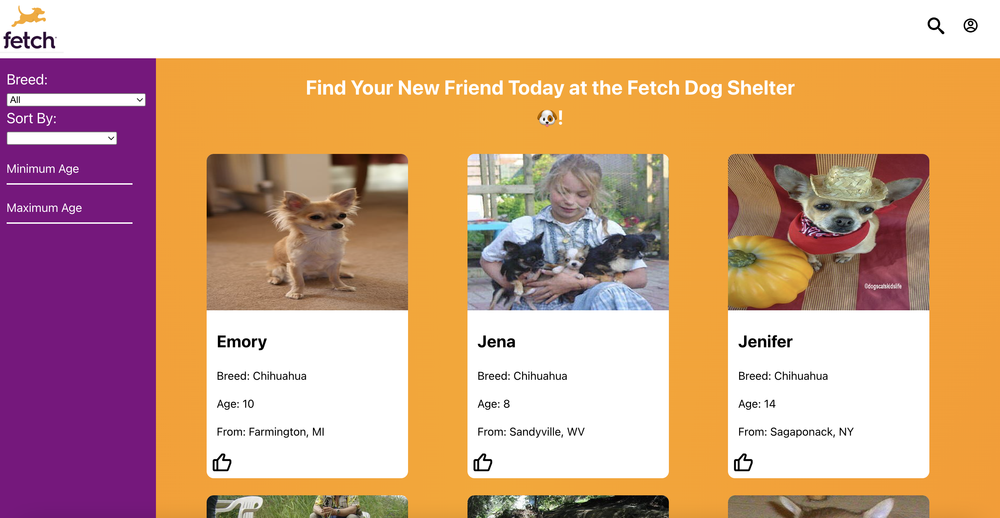

# Fetch-FE-exercise

# To start:
- Fork and clone the application
## Once forked and cloned:
### Running Locally:
- Navigate to the project directory with `cd fetch-fe-excercise`
- Install all of the React dependencies with `npm install`
- Start the frontend server by running the command `npm run dev`
